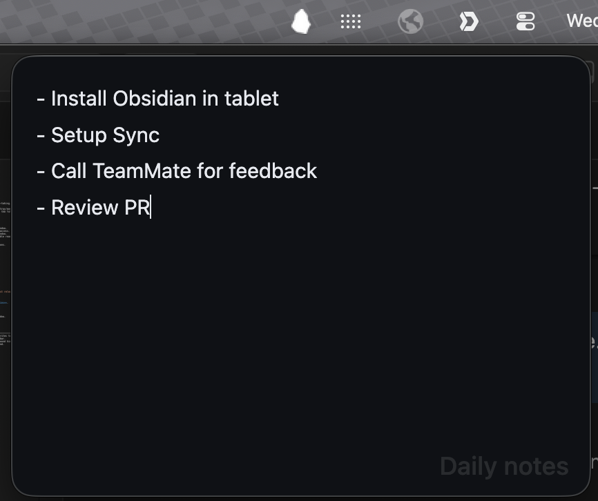

# Pebble

A minimal Obsidian companion that lives in your menu bar for quick note-taking.

Pebble adds a small, always-accessible writing window from your system tray/menu bar. Point it at any markdown file in your vault and start writing without keeping the full Obsidian window front and center.

## Features

- **Minimal** — small and distraction-free writing window.
- **Menu-bar toggle** — click the Pebble icon to open/close the note window.
- **Anchored window (macOS)** — opens near the menu bar icon for quick access.
- **Auto-close on blur** — closes when you click outside the pop-out window.
- **Single-file focus** — choose one markdown note from your vault; Pebble reads and writes only that file.
- **Fast autosave** — edits are written back to disk automatically.
- **Tray icon style** — choose between color and monochrome menu bar icons.
- **Color mode** — choose a light or dark editor background.

## Demo



## Installation

### From community plugins (once published)

1. Open **Settings → Community plugins → Browse**.
2. Search for **Pebble**.
3. Select **Install**, then **Enable**.

### Manual installation

1. Download `main.js`, `manifest.json`, and `styles.css` from the [latest release](https://github.com/pedrojreis/Pebble/releases).
2. Create a folder at `<your-vault>/.obsidian/plugins/pebble/`.
3. Copy the downloaded files into that folder.
4. Reload Obsidian and enable **Pebble** in **Settings → Community plugins**.

## Usage

1. Open **Settings → Pebble** and choose a note from your vault.
2. Click the Pebble menu bar / system tray icon to show or hide the window.
3. Write away.

## Settings

| Setting                      | Description                                      | Default |
| ---------------------------- | ------------------------------------------------ | ------- |
| **Note**                     | The vault note that Pebble reads and writes to.  | None    |
| **Monochrome menu bar icon** | Use a template icon in the macOS menu bar.       | Off     |
| **Show note title**          | Show the note title as a subtle background hint. | On      |
| **Color mode**               | Choose a white or dark editor background.        | Dark    |

## Requirements

- Obsidian **v0.15.0** or later.
- Desktop only (macOS, Windows, Linux). Mobile is not supported.

## Development

```bash
# Install dependencies
npm install

# Build in watch mode
npm run dev

# Production build
npm run build

# Lint
npm run lint
```

## License

[MIT](LICENSE)
